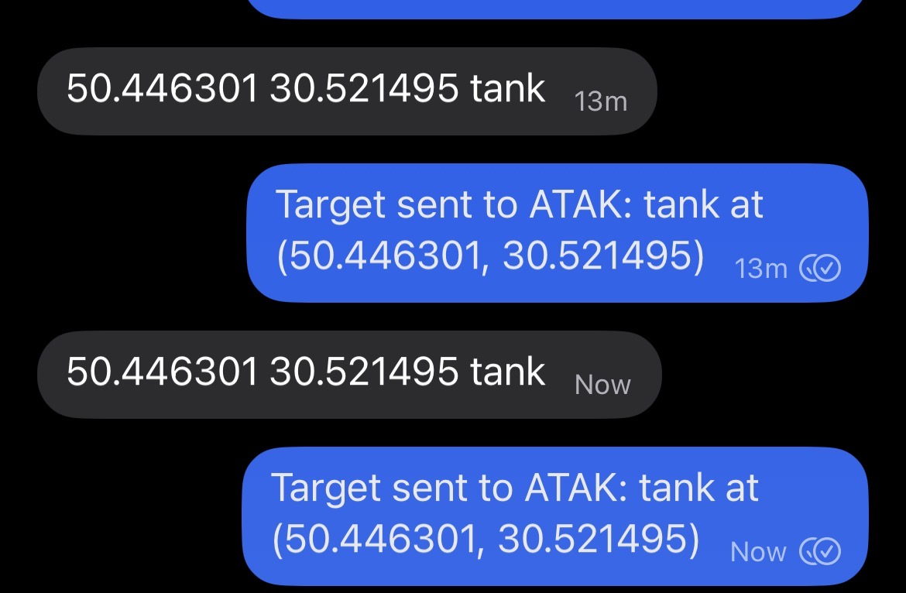
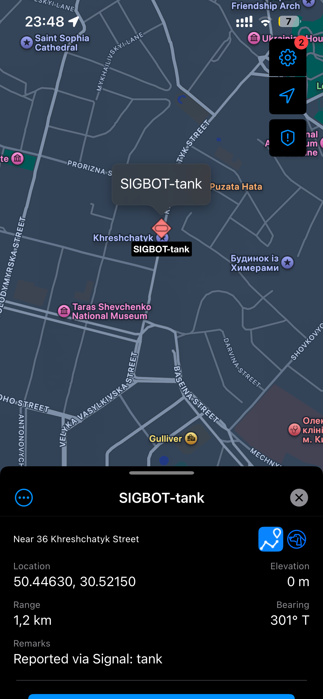

# Testing Guide

Tested on macOS (bot + signal-cli) and iOS (iTAK).

### 1. Link signal-cli

```bash
signal-cli link -n signal-atak-bot
```

Scan the QR code on your phone: Signal > Settings > Linked Devices > Link New Device.

When linking succeeds, you should see:
```
sgnl://linkdevice?uuid=...&pub_key=...
INFO  ProvisioningManagerImpl - Received link information from +<your-number>, linking in progress ...
Associated with: +<your-number>
```

### 2. Start signal-cli daemon

```bash
signal-cli -a <your-number> daemon --tcp localhost:7583 --http localhost:8080 --no-receive-stdout
```

### 3. Start the bot

```bash
SIGNAL_ACCOUNT=<your-number> ATAK_HOST=<iphone-ip> ATAK_USE_MULTICAST=false uv run signal-atak-bot
```

### 4. Configure iTAK on iOS

1. Mac and iPhone must be on the same WiFi network
2. Find your iPhone's IP: Settings > WiFi > tap (i) next to your network
3. Open iTAK on iPhone, enable Mesh Network (Settings > Mesh Networks > toggle on)

### 5. Send a test message

Send a Signal message from another device to your linked number:
```
48.567123 39.87897 tank
```

Expected:
- Bot logs show the message was parsed and CoT was sent
- Bot replies in Signal with a confirmation
- A hostile armor marker appears on the iTAK map

### Troubleshooting

- Verify iPhone is reachable: `ping <iphone-ip>`
- Multicast is often blocked by home routers -- use unicast mode instead
- `192.168.0.1` is typically the router, not your phone -- double-check the IP
- If no marker appears, confirm iTAK has Mesh Network enabled

### Screenshots

Signal bot receiving a message and replying with confirmation:



iTAK showing the received marker on the map:


